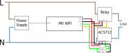

#Power Controller

This repository contains the source code for a WiFi power controller.

##Hardware

The hardware consists of (most components can be easily substituted and some are excessive for lower current applications):
1. [Adafruit Feather M0 WiFi](https://www.adafruit.com/product/3010)
2. ACS712 Current sensor
3. [Relay Module](https://robotdyn.com/relay-module-1-relay-5v-30a.html)
4. USB power supply
5. 2 Resistors

[A pattress box](https://www.wickes.co.uk/Wickes-2-Gang-Pattress-Box-for-Cooker-Control-Units---White-47mm/p/710034) makes a good enclosure.

Be cautious if ordering an ACS712 from Banggood.com, my 20A sensors were delivered with terminals rated for only 10A.



R1 and R2 should be chosen to reduce the 5V output of the ACS712 to the 3.3V range readable by the Analog inputs of the M0 (e.g. R1 should be approximately twice the value of R2).

##Controller software

Written using Arduino using the Wifi101 and [ArduinoJson](https://arduinojson.org/) libraries. The Wifi SSID and password should be added to secrets.h. `serverAddress` and `port` should be updated to the address of the server.

##Server

Collects readings from the controllers and stores them in a MySQL database. Also provides a REST API for the client.

To start:
1. Create a MySQL database, username and password
2. Create a `.env` file and set `MYSQL_USERNAME`, `MYSQL_PASSWORD` and `MYSQL_DB`.
3. run `npm install`
4. run `npm run dev`
5. After a controller connects edit the `controllers` to set the conversion factor. The conversion factor is multiplied with the value read by the controller to give a reading in milliamps. Restart the server after setting altering the database to make the server read the changes.

For example if using the 20A ACS712 1A of current results in 100mV of output.

If R1 is 10kΩ and R2 is 20kΩ this translates to 67mV (`20/(20+10)*100`) output from the voltage divider.

The input to the M0 is 12-bit so ranges from 0 - 4095 for 0 - 3.3v.

The conversion factor can therefore be calculated as:
```
c = 3.3 / S * (R1 + R2) / R2 / 4096 * 1000
```
where `S` is the sensitivity of the ACS712 in Volts per Amp.

In this example:
```
c = 3.3 / 0.1 * (10 + 20) / 20 / 4096 * 1000
c = 12.85
```

##Client

Uses the server's REST API to set schedules and show power usage.

To start:

1. run `npm install`
2. run `npm run serve`
